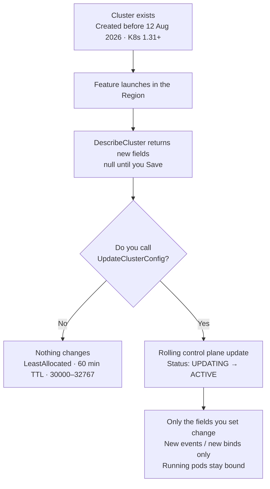
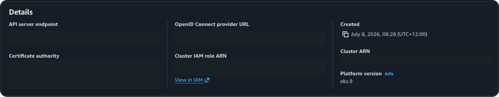
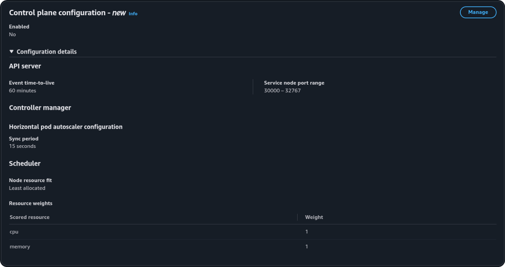
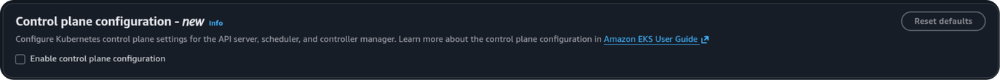
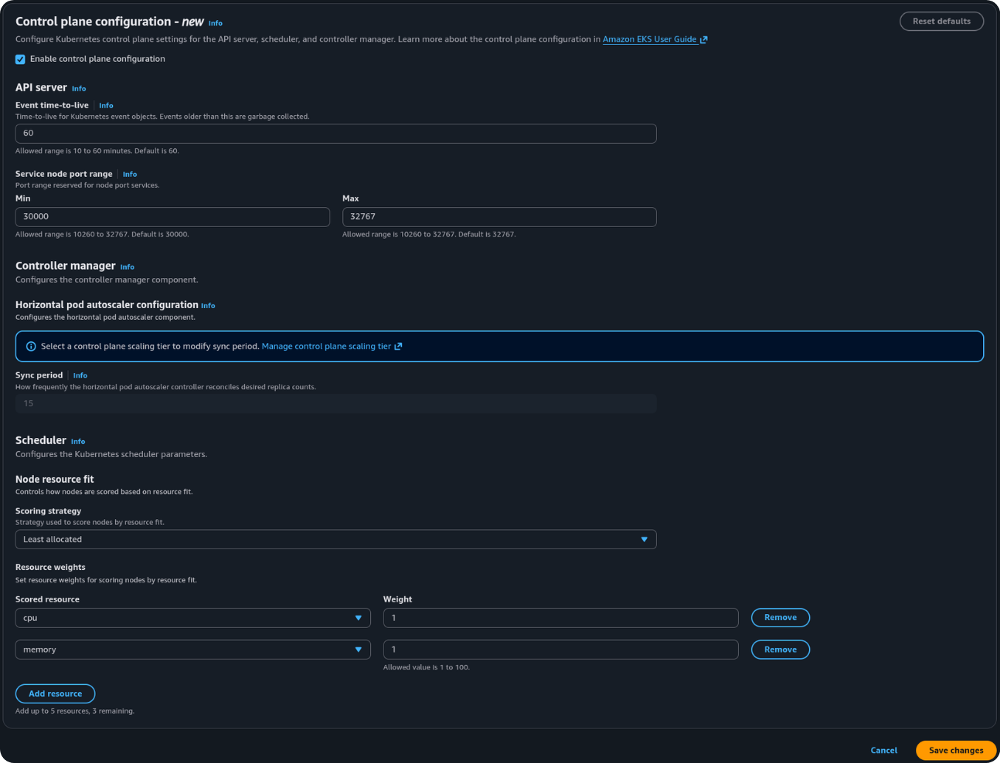
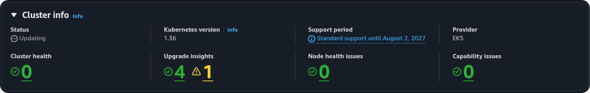
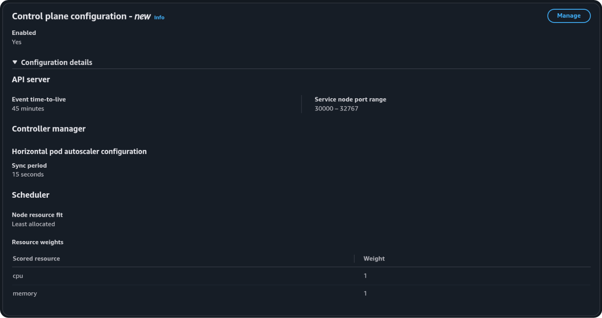

# Existing clusters

A cluster created before 12 August 2026 does not change behaviour when the feature launches in your Region. Amazon EKS never alters a running cluster just because a new parameter becomes available.

CLI commands on this page need AWS CLI **2.36.21** or later. See [Requirements](index.md#requirements). The console does not.

## What changes immediately (and what doesn't)

Two things happen on launch day. Only one is visible, and neither changes how your cluster schedules pods.

**The API response gains new fields.** `describe-cluster` returns `kubeSchedulerConfig`, `kubeControllerManagerConfig`, and `kubeApiServerConfig` even if you never set them. On a cluster that has never been configured, these fields are `null` — not populated with defaults.

**The console shows a new panel.** The cluster detail page includes a "Control plane configuration" section. That the panel exists does not mean anything was applied.

!!! warning "Seeing null ≠ no defaults"
    The `null` values mean you have never explicitly configured these fields — the cluster still uses the upstream defaults (`LeastAllocated`, `60m` TTL, and the default NodePort range). Scheduling, event retention, and NodePort allocation remain as they were until you call `UpdateClusterConfig`.

!!! note "Overview Enabled stays No until a value is not the default"
    Saving the four defaults can finish as a `ControlPlaneComponentConfigUpdate` while the console still shows **Enabled: No**. The badge becomes **Yes** only when at least one field differs from the upstream default — for example event TTL `45m` with scoring still `LeastAllocated`. Time does not flip the badge. **MostAllocated** is not required, and it is not the default you should set just to make the console say Yes.

## Timeline



## Defaults on an unchanged cluster

| Parameter | Value |
| --- | --- |
| Scoring strategy | `LeastAllocated` — cpu weight 1, memory weight 1 |
| Event TTL | `60m` |
| NodePort range | `30000`–`32767` |
| HPA sync period | `15s` |

Requires Kubernetes **1.31** or later. If your cluster is on an older version, upgrade before attempting a configuration update.

## Migrating off a custom scheduler

Skip this section unless the cluster already runs a second scheduler. That is the [workaround from before this feature](../prior/): a customer-managed scheduler in the data plane, because the EKS default could not pack.

This lab cluster (`lab-cluster`) did **not** take that path. Save set event TTL to `45m` and left scoring on `LeastAllocated`. The steps below apply only if you are replacing a custom packer with `MostAllocated` on the managed scheduler.

Amazon EKS does not choose a scheduler for a pod. Kubernetes does, from a field on the pod:

```yaml
spec:
  schedulerName: custom-scheduler   # omit this (or set default-scheduler) to use the EKS-managed process
```

`UpdateClusterConfig` only changes how `default-scheduler` scores nodes. Pods that still name `custom-scheduler` never reach that process.

The three columns use two example Deployments: `web` never set the field; `pack` did. The trap is the middle column — both schedulers pack, and `pack` still ignores the managed one.

<div class="mig">
<div class="mig__col">
<span class="mig__label">Now</span>
<p class="mig__title">Two processes, two strategies</p>
<div class="mig__route">
<code>web</code> — field unset
<span>default-scheduler · LeastAllocated</span>
</div>
<div class="mig__route mig__route--custom">
<code>pack</code> — <code>schedulerName: custom-scheduler</code>
<span>custom-scheduler · MostAllocated</span>
</div>
</div>
<div class="mig__col mig__col--mid">
<span class="mig__label">After the EKS API update</span>
<p class="mig__title">Same routing. Only the default process changed.</p>
<div class="mig__route">
<code>web</code> — field unset
<span>default-scheduler · MostAllocated</span>
</div>
<div class="mig__route mig__route--custom">
<code>pack</code> — field still set
<span>custom-scheduler · MostAllocated</span>
</div>
</div>
<div class="mig__col">
<span class="mig__label">After the Deployment change</span>
<p class="mig__title">One process for both Deployments</p>
<div class="mig__route">
<code>web</code> — field unset
<span>default-scheduler · MostAllocated</span>
</div>
<div class="mig__route">
<code>pack</code> — field removed
<span>default-scheduler · MostAllocated</span>
</div>
</div>
</div>

1. Call `UpdateClusterConfig` with `scoringStrategy: MostAllocated`. Wait until the control plane is ACTIVE.
2. Remove `spec.schedulerName` from the packing Deployments (or set it to `default-scheduler`). Roll them. Only **new** pods switch; running pods stay bound until they are recreated.
3. Confirm new pods land on more-allocated nodes (`kubectl get pods -o wide`). If they do not, check affinity, taints, topology spread, and that the field is actually gone on the new pods.
4. Delete the custom-scheduler Deployment, its RBAC, and any admission webhook that injected `schedulerName`.

## Summary for cluster owners

On launch day an existing cluster keeps `LeastAllocated`, **60 minute** event TTL, NodePorts `30000`–`32767`, and HPA **15s**. None of that changes until you Save.

This lab then set event TTL to **45 minutes**. Scoring stayed `LeastAllocated`. NodePorts and HPA stayed at the defaults. Overview **Enabled: Yes** because TTL is no longer `60m`.

1. Call `UpdateClusterConfig` (or click **Manage** → **Save** in the console).
2. Wait for the rolling control plane update to complete (typically a few minutes).
3. Accept that only the fields you set change, and only for **new** events and **new** scheduling decisions.

Running pods are never moved by a scoring strategy change.

<div class="term">
<p class="term__meta">lab-cluster · Details · created 8 Jul 2026</p>
<figure class="shot-fig">

<figcaption>Created 8 July 2026 — before the 12 August launch. Account identifiers omitted.</figcaption>
</figure>
</div>

<div class="term">
<p class="term__meta">lab-cluster · Control plane configuration · Enabled No</p>
<figure class="shot-fig">

<figcaption>Enabled <strong>No</strong>. The panel shows the previous defaults. Nothing was applied.</figcaption>
</figure>
</div>

<div class="term">
<p class="term__meta">lab-cluster · Manage · Enable unchecked</p>
<figure class="shot-fig">

<figcaption>Manage does not apply a change. The enable box is still off, which matches the <code>null</code> API fields.</figcaption>
</figure>
</div>

<div class="term">
<p class="term__meta">lab-cluster · Manage · Enable checked · defaults</p>
<figure class="shot-fig">

<figcaption>Checking Enable reveals the four controls at their defaults. HPA stays locked on Standard. Nothing is applied until <strong>Save changes</strong>.</figcaption>
</figure>
</div>

<div class="term">
<p class="term__meta">lab-cluster · configuration update in progress</p>
<figure class="shot-fig">

<figcaption>Save starts a rolling control plane update. This is the step that actually applies configuration.</figcaption>
</figure>
</div>

<div class="term">
<p class="term__meta">lab-cluster · Cluster info · Updating</p>
<figure class="shot-fig">

<figcaption>Status is <strong>Updating</strong> until the control plane returns to Active. Running pods stay bound.</figcaption>
</figure>
</div>

<div class="term">
<p class="term__meta">lab-cluster · Control plane configuration · Enabled Yes</p>
<figure class="shot-fig">

<figcaption>Enabled <strong>Yes</strong> after event TTL was set to <strong>45 minutes</strong>. Scoring is still Least allocated. Saving the defaults alone left this badge on No.</figcaption>
</figure>
</div>

<div class="term" markdown>

<p class="term__meta">lab-cluster · ap-southeast-2 · before any Save</p>

```console
$ aws eks describe-cluster --name lab-cluster \
    --query 'cluster.{
      version: version,
      createdAt: createdAt,
      scheduler: kubeSchedulerConfig,
      controller: kubeControllerManagerConfig,
      apiserver: kubeApiServerConfig
    }' --region ap-southeast-2 --output json
{
    "version": "1.36",
    "createdAt": "2026-07-08T08:28:40.494000+12:00",
    "scheduler": null,
    "controller": null,
    "apiserver": null
}
```

</div>

<div class="term" markdown>

<p class="term__meta">lab-cluster · ap-southeast-2 · after event TTL 45m</p>

```console
$ aws eks describe-cluster --name lab-cluster \
    --query 'cluster.{
      version: version,
      createdAt: createdAt,
      scheduler: kubeSchedulerConfig,
      controller: kubeControllerManagerConfig,
      apiserver: kubeApiServerConfig
    }' --region ap-southeast-2 --output json
{
    "version": "1.36",
    "createdAt": "2026-07-08T08:28:40.494000+12:00",
    "scheduler": {
        "nodeResourcesFit": {
            "scoringStrategy": {
                "type": "LeastAllocated",
                "resources": [
                    {"name": "cpu", "weight": 1},
                    {"name": "memory", "weight": 1}
                ]
            }
        }
    },
    "controller": {
        "horizontalPodAutoscalerControllerConfig": {
            "horizontalPodAutoscalerSyncPeriod": "15s"
        }
    },
    "apiserver": {
        "eventTtl": "45m",
        "serviceNodePortRange": {
            "minPort": 30000,
            "maxPort": 32767
        }
    }
}
```

</div>

`null` is before Save. After a non-default (`eventTtl: 45m`) the three objects are populated. Scoring is still `LeastAllocated`. HPA is still `15s` on Standard. Overview **Enabled: Yes** matches this JSON, not a wait.
