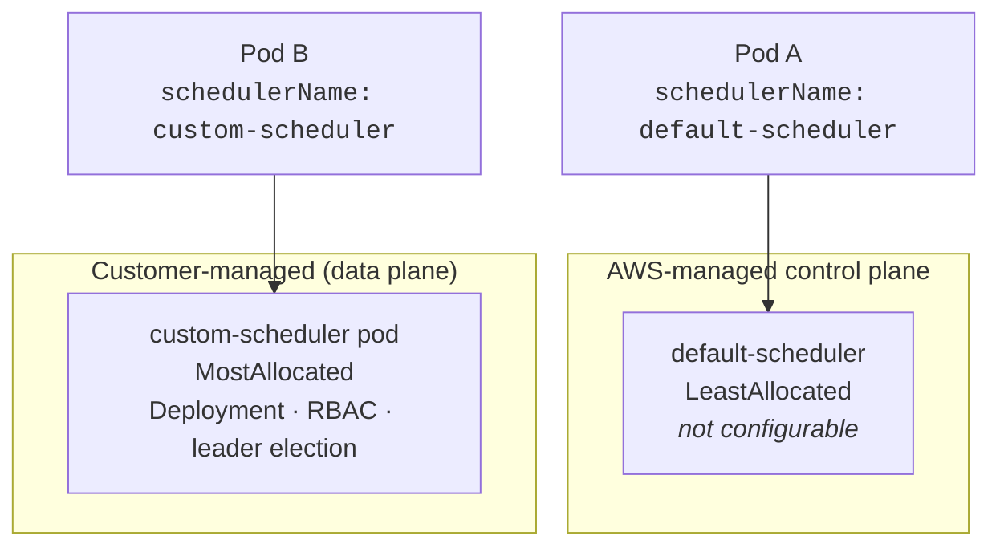
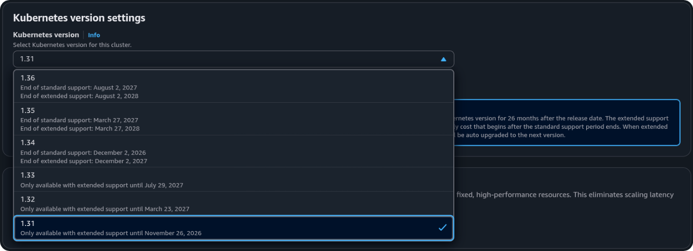
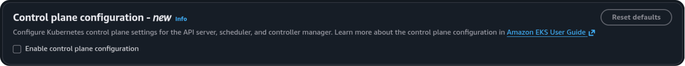
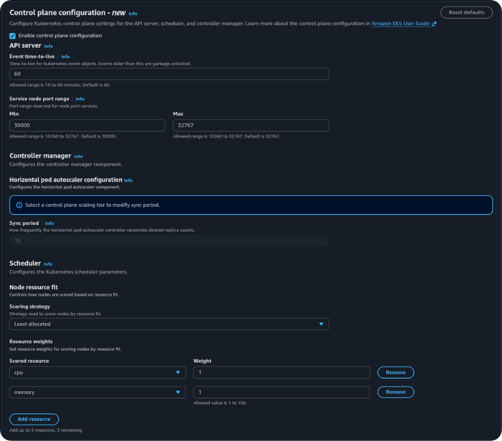

# Before this feature

The Kubernetes scheduler filters nodes that can run a pod, then scores the rest and binds the pod to the highest-scoring node. The upstream default scoring strategy is `LeastAllocated`: prefer nodes with more unused requested capacity. That spreads load and leaves headroom on each node. It also tends to leave several partly used nodes, which makes consolidation harder for Karpenter or Cluster Autoscaler.

## Spread was the EKS default

Node A — 84% CPU requested — lower score under LeastAllocated

Node B — 28% CPU requested — new pod is placed here

Both nodes remain in use. Neither is empty, so a provisioner that consolidates unused nodes has nothing to remove.

Teams that wanted the opposite — place pods on nodes that are already well used, and leave emptier nodes unused — could not set that scoring strategy on the EKS-managed scheduler.

## Custom scheduler workaround

If you wanted bin-packing on EKS, you had to bring your own scheduler and run it alongside the managed one:

Two schedulers, two upgrade paths, and every pod had to declare which one it used. Pods without an explicit `schedulerName` defaulted to `default-scheduler` and kept spreading.

This pattern shows up across the AWS Containers roadmap ([issue 1468](https://github.com/aws/containers-roadmap/issues/1468)) and multiple community write-ups. GKE solved the same problem differently — a single cluster-wide toggle (`optimize-utilization`) that changes the built-in scheduler. EKS didn't offer that until now.

Running a second scheduler meant carrying:

- a highly available Deployment you upgrade with every EKS Kubernetes version
- admission policy to ensure workloads actually set `schedulerName`
- two separate paths for topology spread, taints, and preemption
- no way to touch kube-apiserver settings (event TTL, NodePort range) at all, because those processes live exclusively in the managed control plane

The key difference: GKE's toggle changes what the default scheduler does for all pods. A custom scheduler on EKS only affects pods that explicitly name it. Amazon EKS now exposes the first kind of change — a cluster-wide default — for four parameters.

## What remains unavailable

The upstream `RequestedToCapacityRatio` scoring strategy is not supported. A custom scheduler that used it cannot be replaced by this feature without a behaviour change.

Arbitrary kube-apiserver or kube-scheduler flags, including a full `KubeSchedulerConfiguration`, are still not configurable.

Create cluster · Kubernetes 1.31 · feature floor

<figure class="shot-fig">

<figcaption>Control plane configuration requires Kubernetes <strong>1.31</strong> or later. 1.31 is selected here as the floor.</figcaption>
</figure>

Create cluster · Control plane configuration · Enable off

<figure class="shot-fig">

<figcaption>Same as Manage on an existing cluster: the panel is visible, nothing is applied until Enable and create (or Save).</figcaption>
</figure>

Create cluster · Enable on · defaults

<figure class="shot-fig">

<figcaption>The same four defaults as Manage. HPA is locked unless you choose a Provisioned scaling tier. Create (or Save) is what applies them.</figcaption>
</figure>

